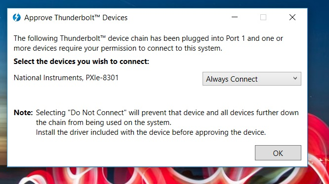
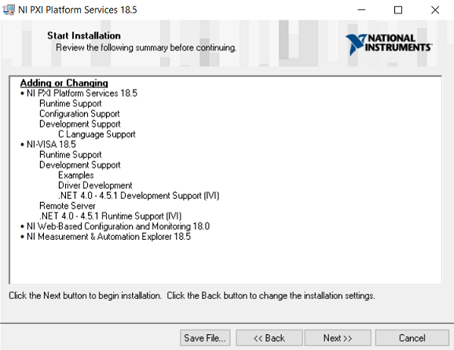
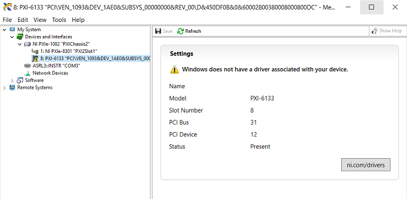
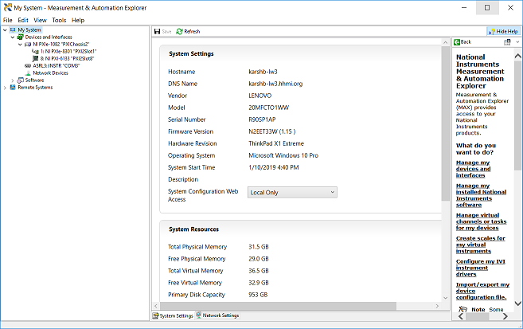

# NI chassis and I/O card setup

------

This document covers the steps to install the necessary software for an NI
chassis, NI remote control module, and an NI acquisition device for
non-neural signals. We've selected a PXI-6133 module in these example.

>SpikeGLX will work with multifunction IO S-series 61XX, M-series 62XX,
X-series 63XX devices, and with digital-only 653X devices. Moreover, you
can use PXI, PCI or USB devices, though USB is slower and should be avoided
for new purchases.

------

## Install Hardware

Start by installing the remote control module (e.g. NI PXIe-8381, NI PXIe-8301)
in the control slot (slot 1, red) in the PXI chassis. If you're using a PXIe-PCIe
link, install the corresponding PCIe card in your computer. The PXI-6133 module and
PXIe imec modules can be installed now or added after all the NI software has
been installed.

------

## Boot Up

Power-on sequence varies for different chassis models and links.

* NI 1082 with any link: Leave the chassis off; it will be automatically
turned on when the computer boots.
* NI 1071 with PXIe-PCIe link: Power chassis on first, then start computer.
* NI 1071 with Thunderbolt link: Power on sequence should not matter; we
recommend powering the chassis on first. Note that although Thunderbolt is
hot-pluggable in many applications, breaking the connection between the computer
and chassis is NOT recommended for a Neuropixels system. The system should be
power cycled if the link is disconnected accidentally.

When Windows boots, the new hardware will be recognized by the system. For the
Thunderbolt link, a dialog comes up asking if you want to always link to this
device; select "Always connect".

>In the device manager, the chassis shows up in Other devices as an
"SM Bus Controller." A Neuropixels module, if the driver software has not been
installed, appears as a "PCIe Memory controller."

------

## Install Platform Services

Depending on the computer, the chassis may or may not be recognized as an NI
device. If it is, a dialog will appear with a link to the download page for the
NI PXI Platform Services driver package. The download page is here:
[PXI Platform Services](http://www.ni.com/en-us/support/downloads/drivers/download.pxi-platform-services.html).

Select the latest, non-runtime version. When you click the download link, you'll
be asked to log in or create an NI account; creating an NI account only requires
an email address.

Following the NI instructions, extract the downloaded zip and run the installer.
Use the default settings for what to install. For version 18.5, that list is:

The only option during the installation is whether to allow automatic updating of
NI software; we recommend against automatic updating of any kind on a high
throughput data acquisition computer.

After the installation, run NI-MAX (Measurement & Automation Explorer). The left
hand pane shows a tree of all the installed devices detected by the software.
The PXI-6133 appears underneath the heading for the chassis (a PCI-6133
installed in the computer shows up as an independent device). Here's the NI-MAX
display for a system with the PXI-6133 installed in an NI 1082 PXI chassis.
Note that the chassis is recognized at this stage. The PXI-6133 is also
recognized, but doesn't have a driver yet.

------

## Install DAQmx

SpikeGLX communicates with the PXI-6133 or PCI-6133 using an NI package called
NI-DAQmx. Use the link in the dialog, or go to
[NI driver downloads](http://www.ni.com/en-us/support/downloads/drivers.html).

Follow the link to the NI-DAQmx drivers. Select the latest version, and pick
the option for `Runtime with Configuration Support`. **Configuration Support**
means NI-MAX gets useful tabs showing device pinouts, signal routing tables,
and tools for creating your own simple test applications.

> The figure shows v18.6 but SpikeGLX has been tested with all versions
up to v19.6. The latest version should be fine.

Follow the NI instructions for downloading and running the installer. The only
options will be where to install (default is fine) and whether to allow updates;
again, we recommend against automated updating.

After the NI-DAQmx installation, run NI-MAX again. Now the PXI-6133 is
recognized and is ready to run:

------

## Hook up your signals

NI sells two varieties of breakout boxes. For the PXI-6133, which has 8 analog
and 8 digital inputs, the BNC-2110 is very convenient. To connect more than 8
analog inputs (e.g. 16 single ended inputs on a PXIe-6341), choose an SCB-68,
which gives direct access to all the pins of the I/O connector.

_fin_

