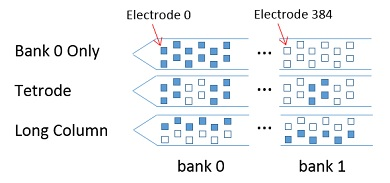

# SpikeGLX Download Page

**Synchronized acquisition from Imec neural probes and NI-DAQ devices.**

* Get compiled apps, support and help stuff on this page.
* See what's new on the site [here](new.md).
* The source code repo is [here](https://github.com/billkarsh/SpikeGLX.git).

>The current commercial version is PXI-based `SpikeGLX 3.0` (also called phase30).

------

## What Is SpikeGLX?

SpikeGLX is a recording system for extracellular neural probes. The emphasis
is on concurrent synchronous recording from high channel count probes together
with numerous auxiliary analog and digital channels:

* Concurrent, synchronized acquisition from Imec and NI-DAQ devices.
* Imec Neuropixels phase3A, phase3B, phase20, phase30 probe support.
* HHMI/Whisper System support.
* Flexible visualization, filtering and sorting tools.
* Programmable triggering.
* Remote control via MATLAB.
* Powerful offline viewing and editing.

------

## System Requirements
**(What to Buy)**

Requirements differ according to platform:

* [For PXI-based setups](https://github.com/billkarsh/SpikeGLX/blob/master/Markdown/SystemRequirements_PXI.md).
* [For all earlier setups](https://github.com/billkarsh/SpikeGLX/blob/master/Markdown/SystemRequirements_Xilinx.md).

------

## Latest Application Downloads

**SpikeGLX 3.0 (PXI, all probe types later than 3A)**:

>News: SpikeGLX 3.0 replaces the 1.0 (3B2) and 2.0 versions. Those are
now retired. The new version supports {1.0, 2.0, NHP, UHD} probes.

>Important: To use SpikeGLX-phase30 you must first update your module
firmware, which is included in the download. Please read the `README`
file for instructions.

* [Release 20200513-phase30](App/Release_v20200513-phase30.zip)...[Readme](Readme/Readme_v20200513-phase30.txt) : First 3.0 release, Imec v3.28

**Xilinx Kintex versions not covered by 3.0**:

* [Release 20190724-phase3B1](App/Release_v20190724-phase3B1.zip)...[Readme](Readme/Readme_v20190724-phase3B1.txt) : Minor bug fixes, Imec v5.1
* [Release 20190724-phase3A](App/Release_v20190724-phase3A.zip)...[Readme](Readme/Readme_v20190724-phase3A.txt) : Minor bug fixes, Imec v4.3

>Suggested organization: Create folder 'SpikeGLX' on your desktop or `C:\`
then download/unzip associated stuff into it. It's fine to have several
versions there as long as you run one at a time:

```
SpikeGLX\
    Release_v20200513-phase30.zip
    Release_v20200520-phase3B2.zip
    Release_v20200513-phase30\
    Release_v20200520-phase3B2\
    Drivers\
        Enclustra_Windows_10\
    Tools\
    Etc\
```

------

## PXI Enclustra Drivers

These required driver files are not included in your SpikeGLX release.

1. Click the link below for your Windows OS version.
2. Unzip the folder into your local folder of SpikeGLX-related stuff.
3. Follow the installation ReadMe in the download.

>Terminology: 'Enclustra' is a company that markets other vendor's FPGAs
along with development and support tools. There are several FPGAs used in
the Neuropixels hardware, including a Xilinx Zynq model, often referred to
as 'the enclustra'.

* [Windows 7 & 8](Support/Enclustra_Win7&8.zip)
* [Windows 10](Support/Enclustra_Win10.zip)

------

## Command-line Tool Installation

* CatGT
* TPrime
* C_Waves

These come as zip files. To install one:

1. Extract the contained folder to any destination you like.
2. Keep the folder contents together, as you do with the SpikeGLX folder.
3. Read the contained `ReadMe.txt` for instructions.
4. Look at the `runit.bat` example batch script.

------

## CatGT

CatGT is a command-line tool that does the following offline operations (all imec phases):

>+ Optionally join trials with given run_name and g-index in t-index range [ta,tb]...
>+ ...Or run on any individual file.
>+ Optionally apply bandpass and global demux CAR filters.
>+ Optionally edit out saturation artifacts.
>+ Optionally extract tables of sync waveform edge times to drive TPrime.
>+ Optionally extract tables of any other TTL event times to be aligned with spikes.
>+ [CatGT: Global Demuxed CAR](help/dmx_vs_gbl/dmx_vs_gbl.md)

* [CatGT 1.2.9](Support/CatGTApp.zip)

------

## TPrime

TPrime is a command-line tool that maps event times (all imec phases):

>+ Map time from one SpikeGLX data stream to any other.
>+ Translate all events to a single common timeline.
>+ Uses sync edges to achieve 1 to 2 sample accuracy.
>+ Maps TTL events extracted using CatGT.
>+ Maps spike times from any sorter.
>+ [Sync: Aligning with Edges.](help/syncEdges/Sync_edges.md)

* [TPrime 1.2](Support/TPrimeApp.zip)

------

## Post-processing Tools

MATLAB and Python tools for parsing meta and binary datafiles (supports 3A, 3B1, 3B2, 20).

* [SpikeGLX_Datafile_Tools](Support/SpikeGLX_Datafile_Tools.zip)

MATLAB tool that converts metadata to JRClust or Kilosort probe geometry data (supports 3A, 3B1, 3B2, 20).

* [SGLXMetaToCoords](Support/SGLXMetaToCoords.zip)

Average cluster waveforms and statistics command-line tool. This can be run separately
like CatGT or used with
[ecephys_spike_sorting](https://github.com/jenniferColonell/ecephys_spike_sorting).

* [C_Waves 1.3](Support/C_WavesApp.zip)

*Jennifer Colonell's* version of the *Allen Institute ecephys_spike_sorting*
pipeline. This Python script-driven pipeline chains together:
CatGT, KS2, Noise Cluster Tagging, C_Waves, QC metrics, TPrime.

* [ecephys_spike_sorting](https://github.com/jenniferColonell/ecephys_spike_sorting)

------

## Interesting Map Files

* [Tetrodes Bank Selection 3B](Support/TetrodePattern_3B.zip) (tetrodes covering banks zero and one)
* [Long Column Bank Selection 3B](Support/LongColPattern_3B.zip) (one column through banks zero and one)



Related help:

* [IMRO Table Anatomy](help/imroTables.md)

------

## Metadata Guides

Descriptions of metafile items for each phase:

* [Metadata_20](https://github.com/billkarsh/SpikeGLX/blob/gh-pages/Support/Metadata_20.md)
* [Metadata_3B2 (NP 1.0)](https://github.com/billkarsh/SpikeGLX/blob/gh-pages/Support/Metadata_3B2.md)
* [Metadata_3B1](https://github.com/billkarsh/SpikeGLX/blob/gh-pages/Support/Metadata_3B1.md)
* [Metadata_3A](https://github.com/billkarsh/SpikeGLX/blob/gh-pages/Support/Metadata_3A.md)

------

## Help

* [Neuropixels Support Page](https://www.neuropixels.org/support)
* [Noise: Learn How To Solder](help/solder/solder.md)
* [Sharpening Apparatus (MS.Word.docx)](Support/NPix_sharpening.docx)
* [Installing NI Drivers](help/NIDriverInstall/NI_driver_installation.md)
* [SpikeGLX UserManual](https://github.com/billkarsh/SpikeGLX/blob/master/Markdown/UserManual.md)
* [SpikeGLX FAQ](https://github.com/billkarsh/SpikeGLX/blob/master/Markdown/SpikeGLX_FAQ.md)
* [CatGT: Global Demuxed CAR](help/dmx_vs_gbl/dmx_vs_gbl.md)
* [Sync: Aligning with Edges](help/syncEdges/Sync_edges.md)
* [Parsing Data Files](help/parsing.md)
* [IMRO Table Anatomy](help/imroTables.md)

------

## How-to Videos

* [Handle & Solder](https://vimeo.com/315542037)
* [Sharpen Probe](https://vimeo.com/359133527)
* [Install Software](https://vimeo.com/316017791)
* [First Run](https://vimeo.com/322145679)
* [Sync](https://vimeo.com/322974285)

------

## Licensing

Use is subject to Janelia Research Campus Software Copyright 1.2 license terms:
[http://license.janelia.org/license](http://license.janelia.org/license).

QLed components are subject to GNU Library GPL v2.0 terms, which are described here:
[https://github.com/billkarsh/SpikeGLX/blob/master/QLed-LGPLv2-LICENSE.txt](https://github.com/billkarsh/SpikeGLX/blob/master/QLed-LGPLv2-LICENSE.txt).


_fin_

